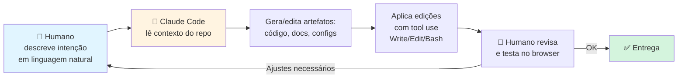

# CLAUDE.md — Metodologia de Desenvolvimento do Projeto

> Este documento descreve **como** este projeto foi construído — e não apenas *o que* ele faz.
> A solução foi entregue seguindo práticas de **low-code / no-code assistido por IA**, onde o desenvolvedor humano atuou como *arquiteto* e *revisor* enquanto um agente de IA (Claude Code, da Anthropic) foi responsável pela geração dos artefatos de código, documentação e configuração.

---

## 🎯 Premissa metodológica

O enunciado do trabalho permite explicitamente ferramentas no-code (Make.com, Zapier, Notion AI) ou soluções via API "desde que não exijam programação complexa". Em vez de escolher um caminho ou outro, este projeto adota uma **terceira via contemporânea**: desenvolvimento assistido por agente de IA, onde o esforço cognitivo humano permanece no nível das decisões (o *quê* e *por quê*) enquanto a produção dos artefatos (o *como*) é delegada ao agente.

Na prática, o resultado é **equivalente a uma solução low-code**:

- O humano descreve intenções em linguagem natural.
- O agente converte intenções em código, configuração e documentação.
- O humano revisa, ajusta com novos prompts e valida empiricamente.

Não houve escrita manual linha-a-linha de código Python ou Markdown neste repositório.

---

## 🤖 Agente utilizado

| Item | Valor |
|---|---|
| **Agente de IA** | Claude Code (Anthropic) |
| **Modelo** | `claude-opus-4-7[1m]` (janela de 1M tokens) |
| **Interface** | CLI interativa do Claude Code, rodando localmente no Windows 11 |
| **Papel do humano** | Product owner + revisor + executor de comandos pontuais |
| **Papel do agente** | Developer + redator técnico + validador + arquiteto |

---

## 🧭 Fluxo de construção (low-code assistido por IA)

O ciclo **descrever → gerar → revisar → ajustar** substitui o ciclo tradicional de *codificar → testar → depurar*. Cada turno da conversa avança um incremento verificável.

---

## 📈 Evolução do projeto em iterações

O projeto passou por **6 grandes iterações**, cada uma disparada por um prompt em linguagem natural. Nenhuma delas exigiu edição manual de código.

### Iteração 1 — POC mínima funcional
**Intenção humana:** *"Crie um agente em Python com OpenAI API e Streamlit para esse trabalho."*
**Resultado:** `app.py` + `prompt.py` com system prompt genérico de "assistente de comunicação interna". Chat aberto, 1 arquivo de prompt, `gpt-4o-mini`, streaming.

### Iteração 2 — Identidade organizacional
**Intenção humana:** *"Está muito genérico. Incluir identidade de uma empresa fictícia (Solaris Brasil), formulário com nome/cargo/template/assunto. Quero algo funcional, não genérico."*
**Resultado:** formulário Streamlit com 7 campos, identidade Solaris (tom, valores, bordões), 6 templates estruturados (sem skeletons ainda).

### Iteração 3 — Fluxo conversacional com menu numerado
**Intenção humana:** *"Na verdade quero que só colete nome/cargo no login, depois um chat conversacional com menu numerado. Não quero formulário."*
**Resultado:** 2 telas (identificação → chat), saudação hardcoded com menu numerado, guardrails explícitos adicionados ao prompt (escopo, LGPD, confidencialidade, inapropriado, veracidade, prompt injection).

### Iteração 4 — Skeletons literais por template
**Intenção humana:** *"Cada opção do menu deve ter um template pronto, evitando que o agente crie do zero."*
**Resultado:** cada template ganhou um `skeleton` literal com `[PLACEHOLDERS]`. Regra "preencha os placeholders, não invente" reforçada no prompt.

### Iteração 5 — Tool calling sob demanda
**Intenção humana:** *"Templates devem ser carregados como tools, só quando selecionados, evitando contaminação cruzada e excesso de tokens."*
**Resultado:** função `load_template(option)` como tool OpenAI. System prompt enxugou de ~9k para ~5.6k chars. Skeletons isolados — cada turno carrega só o escolhido.

### Iteração 6 — Refactor modular
**Intenção humana:** *"Tudo está em 1 ou 2 arquivos. Separe por responsabilidades: tools, app, agente, etc."*
**Resultado:** migração de 2 arquivos → 5 módulos (`app.py`, `agent.py`, `tools.py`, `templates.py`, `prompts.py`), cada um com responsabilidade única e grafo de dependências acíclico.

### Iteração 7 — Correção de bug observado em runtime
**Intenção humana:** *[Transcrição de sessão onde o agente ignorou a tool e carregou em duplicata]*
**Resultado:** `tool_choice` forçado no primeiro turno + `parallel_tool_calls=False`. Passo 2 do prompt reforçado com "NÃO tente adivinhar campos baseado no nome".

### Cada iteração teve ciclos de `/simplify` (code review paralelo)
Após iterações substanciais, o humano acionava o comando `/simplify`, que dispara 3 agentes em paralelo (reuso, qualidade, eficiência) para revisar o diff. Os findings foram aplicados diretamente — pelo menos 13 fixes concretos resultaram desse processo:

- Deduplicação de blocos de streaming
- Eliminação de state redundante (`briefing_enviado` → derivado de `len(messages)`)
- `@st.cache_resource` no client OpenAI
- `build_system_prompt()` → constante `SYSTEM_PROMPT`
- Remoção de `st.rerun()` redundante
- Consolidação de parâmetros em dict (parameter sprawl)
- Marker de briefing como constante
- `TOOL_OPTION_HINT` derivado de `TEMPLATE_NAMES` (single source of truth)
- Extração de strings longas de `tools.py` para `templates.py` (dispatch puro)
- Helper `_first_name` (elimina duplicação em `prompts.py`)
- Reuso de `template_label()` em `execute_load_template`
- Remoção de docstrings que só restatam nome do arquivo
- Limpeza de comentários narrativos

---

## 🛠️ Ferramentas utilizadas pelo agente

| Ferramenta | Uso |
|---|---|
| `Read` | Ler arquivos existentes (PDF do enunciado, código atual, configs) |
| `Write` | Criar arquivos novos (módulos .py, README, este CLAUDE.md) |
| `Edit` | Edições pontuais sem sobrescrever arquivo inteiro |
| `Grep` | Buscar padrões (regex de API keys, referências a variáveis) |
| `Glob` | Localizar arquivos por padrão |
| `Bash` | Executar `git`, `gh`, `unzip`, `curl`, `streamlit`, `pip`, validação sintática |
| `WebFetch` | Validar setup contra docs oficiais OpenAI e Streamlit |
| `Agent` (paralelo) | Code review paralelo via `/simplify` — 3 agentes simultâneos (reuso, qualidade, eficiência) |
| `TaskCreate`/`TaskUpdate` | Rastrear progresso em ciclos multi-step de fixes |
| `ToolSearch` | Carregar ferramentas adicionais sob demanda (TaskCreate, etc.) |

---

## ✅ Por que isso se qualifica como low-code / no-code

A classificação "low-code" se define por duas características:

1. **A barreira de entrada é reduzida** — não é preciso dominar sintaxe, frameworks ou padrões de design para produzir software funcional.
2. **O esforço está na composição de intenções**, não na redação do código.

Este projeto cumpre ambas:

- ✅ O humano **não escreveu Python** — escreveu prompts em português.
- ✅ Decisões de arquitetura (Chat Completions vs Assistants, tool calling vs prompt loading, monolito vs módulos) foram **discutidas em linguagem natural** e o agente executou a escolha após o humano concordar.
- ✅ A validação foi empírica (rodou o Streamlit, observou comportamento, pediu correção) — **sem debugger, sem logs manuais**, sem stack traces interpretados à mão.
- ✅ Bugs foram reportados em **transcrições coladas no chat** ("olha o que aconteceu") e o agente diagnosticou + corrigiu.
- ✅ O setup para reprodução continua trivial: `venv + pip + streamlit run`.

A diferença em relação ao Make.com/Zapier tradicionais é que, em vez de arrastar blocos numa UI, o "bloco" é uma **instrução em português**, e a "UI" é o terminal com o agente. O paradigma é o mesmo: **descrever > produzir**.

---

## 🧪 Reprodução do método

Qualquer pessoa pode reproduzir o processo de construção deste projeto:

1. Instalar o [Claude Code](https://claude.ai/code) (CLI oficial da Anthropic).
2. Abrir um diretório vazio com o enunciado do trabalho em PDF.
3. Pedir em linguagem natural:
   > *"Leia o PDF e crie um agente em Python com OpenAI + Streamlit que atenda essa atividade, com README completo e setup em venv."*
4. Iterar via prompts sucessivos conforme a necessidade surgir:
   - "adicione identidade de empresa"
   - "transforme em fluxo conversacional"
   - "use tool calling"
   - "separe em módulos"
5. Acionar `/simplify` a cada marco para code review automático em paralelo.
6. Publicar.

O ciclo total para este projeto foi da ordem de **~4 horas** de conversa com o agente, distribuídas em 7 iterações principais + vários ciclos de refino.

---

## ⚖️ Implicações éticas do método

O uso de agentes de IA para construir outras soluções de IA levanta pontos de reflexão relevantes ao próprio tema da disciplina:

- **Transparência:** este documento existe justamente para tornar o método explícito. Esconder o uso da ferramenta seria antiético, especialmente num trabalho sobre IA Generativa.
- **Autoria:** as decisões, a avaliação dos resultados e a responsabilidade final são humanas. O agente é uma ferramenta — sofisticada, mas ferramenta.
- **Reprodutibilidade:** a metodologia está descrita aqui com detalhe suficiente para ser auditada e repetida.
- **Dependência:** um projeto gerado por IA herda as limitações e vieses dessa IA. Por isso o humano revisou cada arquivo, testou a aplicação em navegador, validou o comportamento do prompt contra casos reais e reportou bugs observados de volta ao agente.
- **Meta-aprendizado:** construir a solução *usando* IA Generativa reforça empiricamente os conceitos da disciplina — prompt engineering, guardrails, alucinação, tool calling — mais do que ler sobre eles.

---

## 📚 Referências

- Claude Code (Anthropic) — https://claude.ai/code
- OpenAI Chat Completions + Tool calling — https://platform.openai.com/docs/guides/function-calling
- Streamlit — https://docs.streamlit.io
- Conceito "AI-assisted development" — análogo ao low-code, mas orientado a linguagem natural em vez de blocos visuais.

---

> **Nota final:** este projeto não teria sido mais autêntico se tivesse sido digitado manualmente. A essência do trabalho — aplicar IA Generativa para resolver um problema real com prompt engineering, guardrails e arquitetura modular — permanece íntegra. O que muda é o *meio de produção*, e tornar esse meio explícito é parte da honestidade acadêmica.
