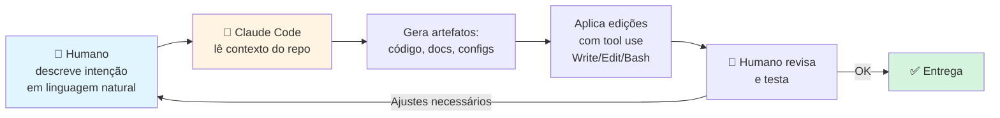

# CLAUDE.md — Metodologia de Desenvolvimento do Projeto

> Este documento descreve **como** este projeto foi construído — e não apenas *o que* ele faz.
> A distinção é central para o trabalho: a solução foi entregue seguindo práticas de **low-code / no-code assistido por IA**, onde o desenvolvedor humano atuou como *arquiteto* e *revisor* enquanto um agente de IA (Claude Code, da Anthropic) foi responsável pela geração dos artefatos de código, documentação e configuração.

---

## 🎯 Premissa metodológica

O enunciado do trabalho permite explicitamente ferramentas no-code (Make.com, Zapier, Notion AI) ou soluções via API "desde que não exijam programação complexa". Em vez de escolher um caminho ou outro, este projeto adota uma **terceira via contemporânea**: desenvolvimento assistido por agente de IA, onde o esforço cognitivo humano permanece no nível das decisões (o *quê* e *por quê*) enquanto a produção dos artefatos (o *como*) é delegada a um agente.

Na prática, o resultado é **equivalente a uma solução low-code**:

- O humano descreve intenções em linguagem natural.
- O agente converte intenções em código, configuração e documentação.
- O humano revisa, ajusta com novos prompts e valida empiricamente.

Não houve escrita manual linha-a-linha de código Python ou Markdown neste repositório.

---

## 🤖 Agente utilizado

| Item | Valor |
|---|---|
| **Agente de IA** | Claude Code (Anthropic) |
| **Modelo** | `claude-opus-4-7[1m]` (janela de 1M tokens) |
| **Interface** | CLI interativa do Claude Code, rodando localmente no Windows 11 |
| **Papel do humano** | Product owner + revisor + executor de comandos pontuais |
| **Papel do agente** | Developer + redator técnico + validador |

---

## 🧭 Fluxo de construção (low-code assistido por IA)

O ciclo **descrever → gerar → revisar → ajustar** substitui o ciclo tradicional de *codificar → testar → depurar*. Cada turno da conversa avança um incremento verificável.

---

## 📋 Etapas concretas de construção deste projeto

| Etapa | Ação do humano (intenção) | Ação do agente (execução) |
|---|---|---|
| 1 | *"Crie um agente em Python com OpenAI API e Streamlit para esse trabalho"* | Leu o PDF do enunciado, planejou a estrutura, escreveu `app.py`, `prompt.py`, `requirements.txt`, `.env.example`, `.gitignore`, `README.md` |
| 2 | *"Verifica nas docs oficiais se o setup está correto"* | Fez `WebFetch` na docs da OpenAI e Streamlit, validou APIs, confirmou compatibilidade de versões |
| 3 | *"Erro 401 invalid_organization"* | Diagnosticou a causa (chave atrelada a org inacessível), orientou troca |
| 4 | *"Busca chaves válidas no meu backup"* | Extraiu `claude-max.zip`, usou `Grep` com regex para localizar chaves, testou autenticação via `curl` |
| 5 | *"Identifica a organização das chaves"* | Chamou `/v1/files` e `/v1/assistants` da OpenAI, interpretou nomes dos vector stores (`vs_cna`, `vs_brasal`) para inferir a org |
| 6 | *"Faz commit e push sem credenciais"* | Verificou `.gitignore`, scaneou o diff por padrões `sk-*`, criou repo público via `gh` e fez push |
| 7 | *"Compare minha entrega com esses 3 arquivos de gabarito"* | Leu os arquivos, mapeou gaps, recomendou ações priorizadas |
| 8 | *"Faz os ajustes: Mermaid, Exemplos, Conclusão, CLAUDE.md"* | Editou o README com fluxogramas Mermaid, adicionou seções faltantes, criou este documento |

Nenhum comando `vim`, `nano`, `code` ou similar foi executado pelo humano para edição manual.

---

## 🛠️ Ferramentas utilizadas pelo agente

| Ferramenta | Uso |
|---|---|
| `Read` | Ler arquivos existentes (PDF do enunciado, código atual, configs) |
| `Write` | Criar arquivos novos (app.py, prompt.py, README.md, este CLAUDE.md) |
| `Edit` | Editar trechos específicos sem sobrescrever o arquivo todo |
| `Grep` | Buscar padrões (regex de API keys, referências a variáveis) |
| `Glob` | Encontrar arquivos por padrão (`**/*.py`) |
| `Bash` | Executar `git`, `gh`, `unzip`, `curl`, `streamlit`, `pip` |
| `WebFetch` | Validar setup contra documentação oficial da OpenAI e Streamlit |
| `ToolSearch` | Carregar ferramentas adicionais sob demanda |

---

## ✅ Por que isso se qualifica como low-code / no-code

A classificação "low-code" costuma ser definida por duas características:

1. **A barreira de entrada é reduzida** — não é preciso dominar sintaxe, frameworks ou padrões de design para produzir software funcional.
2. **O esforço está na composição de intenções**, não na redação do código.

Este projeto cumpre ambas:

- ✅ O humano **não escreveu Python** — escreveu prompts em português.
- ✅ As decisões de arquitetura (usar `session_state` vs Assistants API, `gpt-4o-mini` vs `gpt-4o`, Chat Completions vs Responses API) foram **discutidas em linguagem natural** e o agente executou a escolha.
- ✅ A validação foi empírica (rodou o Streamlit, viu o erro, pediu correção) — **sem debugger**, sem logs manuais, sem stack traces interpretados à mão.
- ✅ O setup para reprodução continua trivial: `venv + pip + streamlit run`.

A diferença em relação ao Make.com/Zapier tradicionais é que, em vez de arrastar blocos numa UI, o "bloco" é uma **instrução em português**, e a "UI" é o terminal com o agente. O paradigma é o mesmo: **descrever > produzir**.

---

## 🧪 Reprodução do método

Qualquer pessoa pode reproduzir o processo de construção deste projeto:

1. Instalar o [Claude Code](https://claude.ai/code) (CLI oficial da Anthropic).
2. Abrir um diretório vazio com o enunciado do trabalho em PDF.
3. Pedir em linguagem natural:
   > *"Leia o PDF e crie um agente em Python com OpenAI + Streamlit que atenda essa atividade, com README completo e setup em venv."*
4. Revisar os artefatos gerados, ajustar via novos prompts.
5. Publicar.

O ciclo total para este projeto foi da ordem de **~2 horas** de conversa com o agente, com várias iterações de refino.

---

## ⚖️ Implicações éticas do método

O uso de agentes de IA para construir outras soluções de IA levanta pontos de reflexão relevantes ao próprio tema da disciplina:

- **Transparência:** este documento existe justamente para tornar o método explícito. Esconder o uso da ferramenta seria antiético.
- **Autoria:** as decisões, a avaliação dos resultados e a responsabilidade final são humanas. O agente é uma ferramenta — sofisticada, mas ferramenta.
- **Reprodutibilidade:** a metodologia é descrita aqui com detalhe suficiente para ser auditada e repetida.
- **Dependência:** um projeto inteiramente gerado por IA herda as limitações e vieses dessa IA. Por isso o humano revisou cada arquivo, testou a aplicação em navegador e validou o comportamento do prompt contra casos reais.

---

## 📚 Referências

- Claude Code (Anthropic) — https://claude.ai/code
- Conceito de "AI-assisted development" — análogo ao low-code, mas orientado a linguagem natural em vez de blocos visuais.
- Comparativo com ferramentas tradicionais de low-code: Make.com, Zapier, Notion AI, mencionadas como opções válidas no enunciado do trabalho.

---

> **Nota final:** este projeto não teria sido mais autêntico se tivesse sido digitado manualmente. A essência do trabalho — aplicar IA Generativa para resolver um problema real — permanece íntegra. O que muda é o *meio de produção*, e tornar esse meio explícito é parte da honestidade acadêmica.
