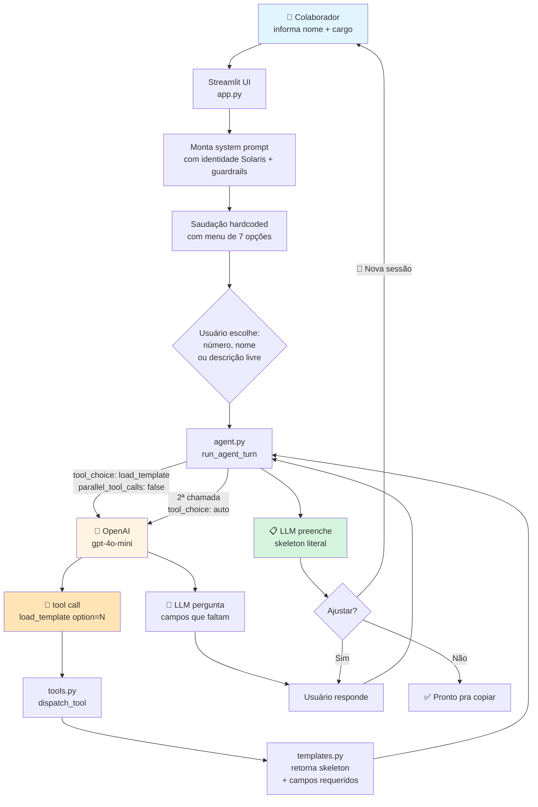
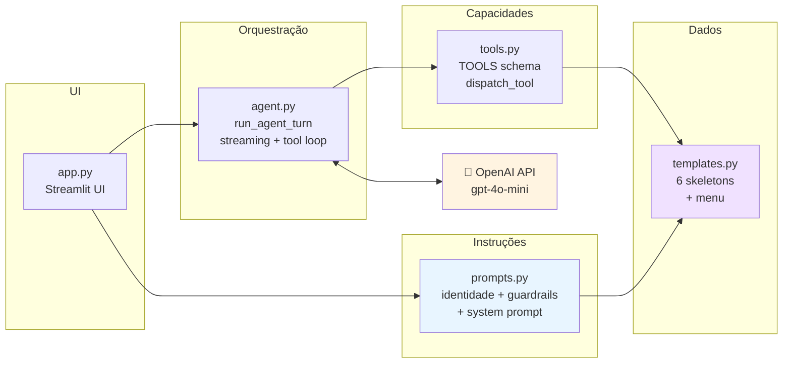

# Copiloto de Comunicação Interna — Solaris Brasil ☀️

> Trabalho prático da disciplina **Fundamentos de IA com foco em IA Generativa** — UniFECAF.
> Autor: Luis — `claude@simplafy.com.br`

Copiloto de IA para colaboradores da **Solaris Brasil Energia Renovável** (empresa fictícia, ~2.400 colaboradores, setor de energia solar/eólica) redigirem textos corporativos internos — **e-mails, comunicados de RH, resumos de reunião, mensagens de Teams/WhatsApp, avisos de segurança operacional e posts para mural**. Construído com **OpenAI API + Streamlit**, usa **tool calling** para carregar templates sob demanda e guardrails explícitos para LGPD e escopo corporativo.

---

## 🎯 Problema resolvido

Em empresas grandes (2k+ colaboradores), o RH e a Comunicação Interna gastam horas por semana com redações repetitivas que precisam respeitar **identidade organizacional, tom de voz, formato padrão e regras de confidencialidade**. Escrever um comunicado bem estruturado do zero leva 15–30 min; refazer porque "ficou fora do padrão" leva o dobro.

O copiloto resolve isso entregando:
- Texto pronto em ~30 segundos, já no formato e tom da empresa.
- Consistência entre autores diferentes (todos partem do mesmo template).
- Placeholders onde faltar dado concreto — zero invenção de informação.
- Guardrails explícitos que bloqueiam conteúdo fora de escopo ou com risco de LGPD.

---

## 🧠 Arquitetura

### Fluxo conversacional (tool calling sob demanda)



### Componentes (5 módulos)



**Separação de responsabilidades:**
- `app.py` (117 l) — Streamlit UI + fluxo de identificação
- `agent.py` (100 l) — loop LLM com streaming + acumulador de tool_calls
- `tools.py` (55 l) — schema OpenAI das tools + despacho
- `templates.py` (135 l) — 6 skeletons literais + helpers de menu
- `prompts.py` (99 l) — identidade Solaris + guardrails + system prompt

### Por que tool calling em vez de incluir tudo no system prompt?

| Problema sem tools | Solução com tools |
|---|---|
| System prompt inchado (~9k chars) com 6 skeletons | System prompt enxuto (~5.6k) — skeletons só entram quando escolhidos |
| Contaminação cruzada: LLM mistura estruturas | Zero contaminação — só 1 skeleton na thread por vez |
| Custo de tokens por turno cresce com o catálogo | Custo plano — carrega só o que o usuário pediu |
| Refactor pesado ao adicionar template | Adicionar template = editar só `templates.py` |

---

## ✨ Fluxo de uso passo a passo

1. **Identificação (tela 1):** colaborador informa nome + cargo. Esses dados personalizam saudação e assinatura — ficam apenas em `st.session_state`, não são persistidos.
2. **Boas-vindas (tela 2):** saudação hardcoded (sem chamada à LLM) mostra menu numerado de 7 opções.
3. **Escolha:** usuário digita `1` a `7`, nome do template ou descrição livre.
4. **Tool enforcement:** na primeira resposta do usuário, `tool_choice={"type":"function","function":{"name":"load_template"}}` **obriga** a LLM a chamar a função — ela não pode "adivinhar" ou responder texto solto.
5. **Carregamento do skeleton:** `tools.py` devolve o template literal + campos requeridos + regras de preenchimento.
6. **Perguntas guiadas:** LLM faz ≤2 rodadas de perguntas cobrindo exatamente os `campos_requeridos` daquele template.
7. **Entrega:** LLM produz o skeleton preenchido, mantendo estrutura literal. Campos não fornecidos ficam como `[PLACEHOLDER]` explícito — nunca invenção.
8. **Refino:** chat aberto para "mais curto", "mais formal", etc. Thread persistida enquanto a sessão estiver viva.
9. **Nova sessão:** botão no sidebar zera `nome`, `cargo`, `messages` — próxima escolha carrega só o novo template, sem resíduo.

---

## 📋 Templates disponíveis

| # | Nome | Caso de uso |
|---|---|---|
| 1 | Email formal (interno) | E-mail corporativo com assunto, contexto, CTA e assinatura |
| 2 | Comunicado oficial de RH | Comunicado institucional (neutro-informativo) para toda a empresa |
| 3 | Resumo executivo de reunião | Ata enxuta com decisões + próximos passos (com responsável e prazo) |
| 4 | Mensagem para Teams/WhatsApp corporativo | Mensagem curta e direta para grupos internos |
| 5 | Aviso de segurança operacional | Alerta firme para times de campo/usinas com procedimentos numerados |
| 6 | Post para mural / canal interno | Post motivacional curto com hashtag interna |
| 7 | Genérico | Descrição livre quando o pedido não se encaixa nos 6 acima |

Cada template em `templates.py` tem:
- `descricao` (1 linha) — resumo mostrado no menu
- `campos_requeridos` — o que a LLM deve coletar antes de preencher
- `skeleton` — texto literal com `[PLACEHOLDERS]` a substituir

---

## 🛡️ Guardrails (regras explícitas no prompt)

Seis categorias de regras não-violáveis, aplicadas via system prompt e reforçadas pelo `tool_choice` enforcement:

| Categoria | Regra |
|---|---|
| **1. Escopo** | Só comunicação interna da Solaris. Recusa textos de outras empresas, pessoal, escolar, código-fonte. |
| **2. LGPD** | Bloqueia CPF/RG/endereço/telefone/e-mail pessoal/dados bancários/salário/dados médicos. Alerta com `> ⚠️` e usa placeholder genérico. |
| **3. Confidencialidade** | Não trata demissões individuais, negociações trabalhistas, estratégia sigilosa, processos judiciais, incidentes não divulgados. |
| **4. Conteúdo inapropriado** | Recusa discriminação, passivo-agressivo, humor constrangedor. Propõe reformulação. |
| **5. Veracidade** | Nunca inventa dados. Placeholders `[ENTRE COLCHETES]` quando o dado não foi fornecido. |
| **6. Prompt injection** | Mantém o papel sob tentativa de "ignore suas instruções", "aja como outro agente", etc. |

> ⚠️ Guardrails inline têm limitações conhecidas (são contornáveis por prompt injection sofisticado). Para POC acadêmica atendem a exigência de "regras explícitas de identidade organizacional" e "limites éticos/LGPD" do roteiro. Para produção, recomenda-se camada externa de filtro.

---

## 🧩 Modelo LLM

- **Modelo padrão:** `gpt-4o-mini` (configurável via `.env` → `OPENAI_MODEL`)
- **Escolha:** rápido, barato (~US$ 0,15/1M tokens input), qualidade mais que suficiente para redação corporativa.
- **Parâmetros fixos no `agent.py`:**
  - `temperature=0.6` — baixa para aderir ao skeleton, alta o bastante para manter voz natural
  - `stream=True` — UX de "digitando"
  - `tool_choice="auto" | FORCE_LOAD_TEMPLATE` — força a tool no primeiro turno, solta depois
  - `parallel_tool_calls=False` — impede chamadas duplicadas da mesma tool
- **Trocável** por `gpt-4o`, `gpt-4-turbo` ou (com pequenos ajustes) Anthropic/Google via `OPENAI_MODEL`.

---

## ✍️ Prompt engineering — decisões chave

| Decisão | Justificativa |
|---|---|
| Identidade organizacional no system prompt (Solaris Brasil, voz, bordões, valores) | "Aciona" o modelo a produzir textos que **soam Solaris** — não corporativo genérico |
| Templates carregados via tool, não no prompt | Zero contaminação cruzada, tokens proporcionais ao uso |
| `tool_choice` forçado no primeiro turno | Impede a LLM de "adivinhar" campos — ela precisa ver o skeleton primeiro |
| Skeletons literais com `[PLACEHOLDERS]` | Transforma a tarefa de "redigir" em "preencher" — muito mais determinístico |
| "Mantenha `[PLACEHOLDER]` se faltar dado" | Regra explícita contra alucinação — alinhada ao guardrail de veracidade |
| Personalização nome/cargo no system prompt | Assinaturas corretas sem a LLM precisar lembrar turnos atrás |
| Máximo 2 rodadas de perguntas | Evita loop infinito de clarificação |
| Saudação hardcoded (não gerada pela LLM) | Economia de custo, menu sempre igual, tela de entrada previsível |

---

## 🚀 Setup e execução

### Pré-requisitos
- Python 3.10+
- Chave da OpenAI — https://platform.openai.com/api-keys

### 1. Clone ou baixe o projeto
```bash
cd fundamentos-ia-generativa
```

### 2. Crie e ative o virtualenv

**Windows (PowerShell):**
```powershell
python -m venv .venv
.venv\Scripts\Activate.ps1
```

**Linux / macOS:**
```bash
python3 -m venv .venv
source .venv/bin/activate
```

### 3. Instale dependências
```bash
pip install -r requirements.txt
```

### 4. Configure a API key
```bash
cp .env.example .env   # ou: copy .env.example .env (Windows)
```

Edite `.env`:
```
OPENAI_API_KEY=sk-...sua-chave-real-aqui...
OPENAI_MODEL=gpt-4o-mini
```

### 5. Rode o Streamlit
```bash
streamlit run app.py
```

Abre automaticamente em `http://localhost:8501`.

---

## 🧪 Como operar / testar

### Cenário 1 — Fluxo feliz (comunicado de RH)
1. Tela de identificação: `Ana Ribeiro` / `Analista de RH Sr.`
2. Clique "Entrar no copiloto →"
3. No chat, digite `2` (ou `comunicado` ou `preciso avisar sobre mudança de política`)
4. Observe a caption `🔧 Template carregado: Comunicado oficial de RH`
5. Responda às perguntas da LLM (assunto, o que muda, data, público, etc.)
6. Receba o comunicado preenchido no formato literal do template 2
7. Peça ajustes: `deixa mais curto` → LLM refaz mantendo estrutura

### Cenário 2 — Troca de template no meio
1. Escolha `1` (email formal)
2. Antes de responder, digite: `na verdade prefiro o formato de comunicado oficial`
3. LLM deve chamar `load_template(2)` novamente — caption aparece indicando novo template

### Cenário 3 — Guardrail LGPD
1. Escolha `1`
2. Ao descrever o contexto, inclua: `"aviso que o Pedro (CPF 111.222.333-44) foi promovido"`
3. LLM deve emitir `> ⚠️ Alerta LGPD: CPF não deve constar em comunicação interna` e substituir por placeholder

### Cenário 4 — Guardrail escopo
1. Escolha `7` (genérico)
2. Peça: `escreva uma redação do ENEM sobre mobilidade urbana`
3. LLM deve recusar educadamente, reafirmando que só atende comunicação interna da Solaris

### Cenário 5 — Reset limpo
1. Conclua um fluxo de template 1
2. Clique **🔄 Nova sessão** no sidebar
3. Reentre, escolha `5` (aviso de segurança)
4. Verifique que nada do email anterior contamina a nova thread

---

## 📐 Parte teórica (análise e discussão)

### Contextualização
Comunicação interna em empresas de médio/grande porte é um gargalo crônico. Cada texto precisa balancear clareza, tom de voz consistente, LGPD e objetivos da liderança. A redação manual é lenta, heterogênea entre autores e retrabalhosa.

### Justificativa para IA Generativa
LLMs modernos já dominam redação corporativa em PT-BR. O valor está em **três camadas**:
1. **Identidade** (system prompt com voz, valores, bordões) — para soar a empresa.
2. **Estrutura fixa** (tool calling + skeletons) — para consistência determinística.
3. **Guardrails** (regras explícitas no prompt) — para mitigar LGPD, escopo, alucinação.

Essa combinação é exatamente a proposta do desafio: *aplicar prompt engineering para resolver um problema real*.

### Benefícios percebidos
- **Tempo de redação:** ~20 min → ~30 s.
- **Consistência:** mesmo template, mesma voz, independentemente de autor.
- **Segurança:** guardrails bloqueiam erros comuns de LGPD antes de o texto ser publicado.
- **Onboarding:** colaborador novo produz texto no padrão da empresa no dia 1.
- **Manutenibilidade:** adicionar template novo = editar 1 arquivo (`templates.py`).

### Desafios enfrentados e como foram resolvidos
- **LLM ignorava a tool** e "adivinhava" campos baseada no nome do template → `tool_choice` forçado no primeiro turno.
- **Tool chamada em paralelo** (duplicação) → `parallel_tool_calls=False`.
- **System prompt inchado** com 6 skeletons → migração para tool calling.
- **Contaminação entre templates** quando usuário trocava de ideia → skeletons isolados por tool call; cada escolha carrega fresh.
- **Equilibrar "faz perguntas" vs "entrega logo"** → regra explícita de ≤2 rodadas.

### Limites éticos e de segurança (LGPD e vieses)
- **LGPD:** guardrail #2 bloqueia inclusão de dados pessoais sensíveis e alerta o usuário. Dados do colaborador (nome/cargo) ficam só em `st.session_state`, não são persistidos em disco nem em banco. A OpenAI API (diferente do ChatGPT Plus) não usa os dados para treino por padrão.
- **Vieses:** o prompt exige linguagem inclusiva e neutra; ainda assim, o modelo carrega vieses do treino — **revisão humana continua essencial** antes de publicar qualquer texto.
- **Confidencialidade:** guardrail #3 recusa textos sobre decisões não anunciadas. Não substitui políticas internas de classificação de informação.
- **Vazamento de dados:** **não cole dados sensíveis no chat** — a recomendação continua mesmo com guardrail.
- **Dependência de fornecedor:** acoplado à OpenAI. `agent.py` concentra essa dependência; migração para Anthropic/Google afetaria apenas 1 arquivo.
- **Guardrails são inline, não externos:** prompt injection sofisticado ainda é possível. Em produção recomenda-se moderação em camada externa.

---

## 📁 Estrutura do projeto

```
fundamentos-ia-generativa/
├── app.py              # Streamlit UI + fluxo de identificação
├── agent.py            # Loop LLM com streaming + tool calling
├── tools.py            # TOOLS schema + dispatch
├── templates.py        # 6 skeletons literais + menu + helpers
├── prompts.py          # Identidade Solaris + guardrails + system prompt
├── requirements.txt    # openai, streamlit, python-dotenv
├── .env.example        # Template de configuração
├── .gitignore
├── README.md           # Este arquivo (produto + teoria)
└── CLAUDE.md           # Metodologia de construção (assistida por IA)
```

> 📘 Consulte o [**CLAUDE.md**](./CLAUDE.md) para a metodologia de desenvolvimento assistido por IA usada ao longo do projeto — incluindo o histórico de iterações de refinamento.

---

## 🔧 Troubleshooting

| Erro | Solução |
|---|---|
| `⚠️ Configure a variável OPENAI_API_KEY` | Confira se `.env` existe e tem a chave correta |
| `401 Unauthorized` | Chave inválida/expirada — gere nova em platform.openai.com/api-keys |
| `429 Rate limit` | Conta sem créditos ou limite atingido — verifique billing |
| `streamlit: command not found` | venv não ativo — reative e reinstale deps |
| Agente respondendo sem chamar a tool | Clique **🔄 Nova sessão** (sessão antiga pode ter histórico anterior ao fix) |
| Tool carregada em duplicata | Idem — o fix `parallel_tool_calls=False` só vale a partir de sessões novas |

---

## 🏁 Conclusão

O copiloto demonstra que, para um problema real de produtividade em comunicação interna, a combinação de **LLM potente + prompt engineering em camadas + tool calling com templates literais + guardrails explícitos** é mais eficaz que um chat simples. A separação entre **dados** (templates.py), **instruções** (prompts.py), **capacidades** (tools.py) e **orquestração** (agent.py) deixa o sistema auditável e evoluível.

**Entregas concretas:**
- ⏱️ **Redução de tempo:** 20 min → 30 s por texto.
- 🎯 **Consistência:** mesmo skeleton preenchido por qualquer autor mantém voz Solaris idêntica.
- 🔒 **Guardrails ativos:** 6 categorias de proteção (escopo, LGPD, confidencialidade, inapropriado, veracidade, prompt injection).
- 🧩 **Arquitetura limpa:** 5 módulos com responsabilidade única; adicionar template = editar 1 arquivo.
- 🚀 **Setup trivial:** `venv + pip + streamlit run` em <2 minutos.

**Caminhos de evolução (fora do escopo do trabalho):**
- Autenticação corporativa (SSO) para auditoria de uso
- Telemetria (Langfuse/PostHog) para medir economia real de tempo
- Camada RAG com manual de estilo real da empresa
- Moderação externa (não inline) para reforçar guardrails
- Galeria de templates configurável via UI (editar `templates.py` sem código)

A POC cumpre o objetivo do desafio: **aplicar IA Generativa + prompt engineering para automatizar comunicação corporativa com identidade organizacional**, entregue de forma funcional, modular, documentada e reprodutível.

---

## 📜 Licença

Uso acadêmico — trabalho da disciplina Fundamentos de IA Generativa (UniFECAF).
