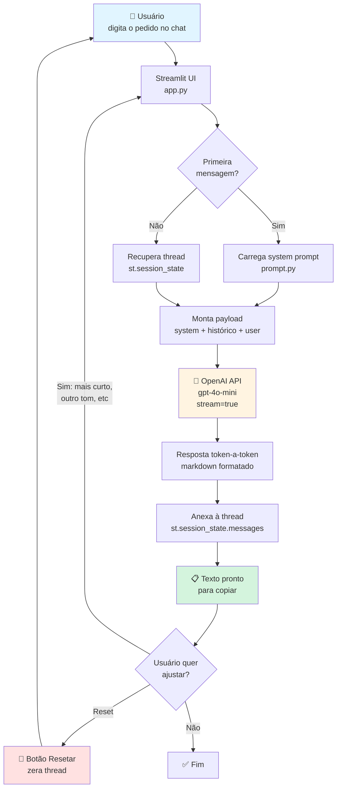
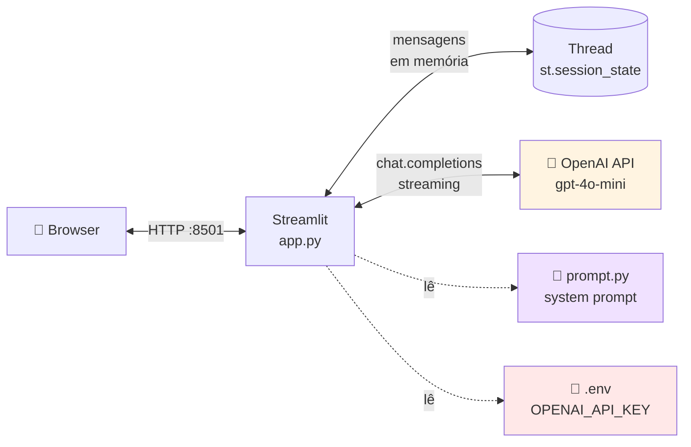

# Copiloto de Comunicação Interna — IA Generativa

> Trabalho prático da disciplina **Fundamentos de IA com foco em IA Generativa** — UniFECAF.
> Autor: Luis — `claude@simplafy.com.br`

Assistente de IA que ajuda colaboradores a redigir **e-mails, resumos de reunião, mensagens de WhatsApp corporativo e avisos institucionais** a partir de inputs simples (tópico, tipo de texto, tom de voz). Construído com **OpenAI API + Streamlit** em um setup mínimo, pensado para rodar em qualquer máquina em menos de 2 minutos.

---

## 🎯 Problema resolvido

O RH de uma empresa de comunicação interna está sobrecarregado com demandas repetitivas de redação. O copiloto automatiza 80% desses textos mantendo identidade organizacional, clareza e tom adequado ao canal.

## 🧠 Como funciona

### Fluxograma do workflow



### Componentes



- **Thread persistente em memória**: o histórico fica em `st.session_state` enquanto a aba do browser estiver aberta. O modelo recebe toda a conversa a cada turno, mantendo contexto (pedir "deixa mais curto" funciona).
- **Reset**: botão na sidebar zera a thread e recomeça limpo.
- **Streaming**: resposta aparece token-a-token (UX de "digitando").
- **Sem integrações externas**: apenas a API da OpenAI. Nada de MCP, RAG ou ferramentas. Setup trivial.

## 🧩 Modelo LLM

- **Modelo padrão:** `gpt-4o-mini` (configurável via `.env`).
- Escolhido por ser rápido, barato (~US$ 0,15/1M tokens input) e ter qualidade mais que suficiente para redação corporativa.
- Pode ser trocado por `gpt-4o` ou `gpt-4-turbo` editando `OPENAI_MODEL`.

## ✍️ Prompt engineering

O system prompt (veja `prompt.py`) foi elaborado com as seguintes decisões:

| Decisão | Justificativa |
|---|---|
| Persona explícita ("Copiloto de Comunicação Interna") | Ancora o escopo e impede desvios |
| Lista de tipos de texto suportados | Foca o modelo no domínio corporativo |
| "1 a 2 perguntas no máximo" quando faltar contexto | Evita loop infinito de clarificação |
| Placeholders explícitos (`[NOME DO GESTOR]`) | Previne alucinação de dados internos |
| Alerta sobre LGPD e tom passivo-agressivo | Camada de segurança/ética no próprio prompt |
| Formato markdown com blocos "pronto para copiar" | Otimiza para o caso de uso real (copy-paste) |

---

## 🚀 Setup e execução (passo a passo)

### Pré-requisitos
- Python 3.10+ instalado
- Uma chave da OpenAI (https://platform.openai.com/api-keys)

### 1. Clone ou baixe o projeto

```bash
cd C:/Users/luis/projetos/pessoal/fundamentos-ia-generativa
```

### 2. Crie e ative o virtualenv

**Windows (PowerShell):**
```powershell
python -m venv .venv
.venv\Scripts\Activate.ps1
```

**Windows (cmd):**
```cmd
python -m venv .venv
.venv\Scripts\activate.bat
```

**Linux / macOS:**
```bash
python3 -m venv .venv
source .venv/bin/activate
```

### 3. Instale as dependências

```bash
pip install -r requirements.txt
```

### 4. Configure sua API key

Copie o template e preencha com sua chave:

**Windows:**
```powershell
copy .env.example .env
```

**Linux / macOS:**
```bash
cp .env.example .env
```

Edite `.env`:
```
OPENAI_API_KEY=sk-...sua-chave-real-aqui...
OPENAI_MODEL=gpt-4o-mini
```

### 5. Rode o Streamlit

```bash
streamlit run app.py
```

O browser abre automaticamente em `http://localhost:8501`.

---

## 🧪 Como testar

1. Na primeira tela, digite uma das sugestões da sidebar, por exemplo:
   > *"E-mail formal avisando que o RH mudou o horário de atendimento para 10h–16h a partir de segunda."*
2. O assistente entrega um e-mail pronto (assunto + corpo) com placeholders onde faltar dado.
3. Teste a **memória da thread**: na sequência, peça:
   > *"Deixa mais curto e em tom WhatsApp."*
   O assistente mantém o contexto e reescreve.
4. Teste o **reset**: clique em **🔄 Resetar thread** na sidebar. O contador zera e o histórico some.
5. Teste **outros tipos**:
   - "Resumo de reunião: falamos sobre metas Q2, bateu 80%, próximo encontro dia 30."
   - "Mensagem de WhatsApp convidando time de dev para happy hour sexta 19h."
   - "Comunicado institucional sobre nova política de home office híbrido."

---

## 💡 Exemplos de uso (Input → Output)

Saídas reais geradas pelo agente durante os testes. O usuário digita um input em linguagem natural e recebe o texto pronto para copiar.

---

### Exemplo 1 — Aviso institucional formal

**Input do usuário:**
> *E-mail formal avisando que o RH mudou o horário de atendimento para 10h–16h a partir de segunda-feira, por ajuste de equipe.*

**Output do agente:**

```
Assunto: Novo horário de atendimento do RH a partir de segunda-feira

Prezados(as) colaboradores(as),

Informamos que, a partir de segunda-feira, o horário de atendimento do
setor de Recursos Humanos passará a ser das 10h às 16h. A mudança
decorre de um ajuste interno de equipe e tem como objetivo manter a
qualidade do atendimento prestado.

Solicitações urgentes fora desse horário podem ser encaminhadas por
e-mail para [E-MAIL DO RH], e serão respondidas no próximo dia útil.

Agradecemos a compreensão de todos.

Atenciosamente,
[NOME DO RESPONSÁVEL]
Recursos Humanos
```

> ✅ Note os **placeholders** (`[E-MAIL DO RH]`, `[NOME DO RESPONSÁVEL]`) — o agente não inventa dados internos.

---

### Exemplo 2 — Continuidade da thread (memória persistente)

Sequência do Exemplo 1. O usuário manda uma segunda mensagem e o agente mantém contexto.

**Input do usuário:**
> *Agora deixa mais curto e em tom de WhatsApp corporativo.*

**Output do agente:**

```
📣 Atenção, pessoal!

A partir de segunda-feira, o RH atende das 10h às 16h.
Fora desse horário, mandem e-mail para [E-MAIL DO RH] que
respondemos no próximo dia útil.

Qualquer dúvida, só chamar! 🙋
```

> ✅ O agente **lembra do contexto** (mudança de horário do RH) sem precisar repetir. A thread persistente é o que permite esse refinamento iterativo.

---

### Exemplo 3 — Mensagem motivacional para WhatsApp

**Input do usuário:**
> *Mensagem curta de WhatsApp para incentivar o time a participar da campanha de saúde: check-up gratuito até 20/09, tom motivacional.*

**Output do agente:**

```
🚨 Atenção, equipe!

Já começou a campanha de saúde com check-up gratuito
para todos os colaboradores! 💙

Agende seu horário até 20/09 e cuide do seu bem-estar.
O primeiro passo para grandes conquistas é uma vida saudável. 💪

👉 Para agendar: [LINK DE AGENDAMENTO]
```

---

### Exemplo 4 — Resumo de reunião

**Input do usuário:**
> *Resumo de reunião: falamos sobre metas do Q2, time bateu 80% do target, próxima reunião dia 30/04, presentes: João (comercial), Maria (produto), Pedro (CS). Tom profissional mas direto.*

**Output do agente:**

```
## Resumo — Reunião de acompanhamento Q2

**Participantes:** João (Comercial), Maria (Produto), Pedro (CS)
**Data:** [DATA DA REUNIÃO]

### Principais pontos discutidos
- **Atingimento do Q2:** o time bateu 80% do target estabelecido.
- **Gap de 20%:** necessidade de analisar causas e ajustar
  estratégia para os próximos ciclos.

### Próximos passos
- Nova reunião agendada para **30/04**, com foco em:
  - Análise detalhada dos 20% não atingidos
  - Plano de ação para recuperação
  - Alinhamento de metas para Q3

**Responsáveis pelo follow-up:** João, Maria e Pedro.
```

> ✅ O agente **estrutura automaticamente** em tópicos, adiciona placeholder para a data que não foi fornecida e cria próximos passos derivados do contexto.

---

## 📐 Parte teórica (análise e discussão)

### Contextualização
Comunicação interna é um gargalo clássico de RH. Escrever um comunicado bem redigido leva 15–30 min de ida e volta. Para um time de 10 pessoas do RH isso se soma a horas por semana.

### Justificativa para IA Generativa
LLMs modernos já dominam redação corporativa em português. O valor está em **prompt engineering bem desenhado + ergonomia** (interface simples, histórico, reset), não em modelos customizados. Esta é exatamente a proposta do trabalho: *não programação complexa, foco em solução*.

### Benefícios percebidos
- Tempo de redação cai de ~20min para ~30s.
- Consistência de tom entre comunicados diferentes (o system prompt é o "manual de estilo").
- Onboarding de novos colaboradores fica trivial — basta dar o link.

### Desafios enfrentados
- Equilibrar "faz perguntas" vs "entrega logo" — resolvido limitando a no máximo 2 perguntas quando faltar contexto.
- Evitar alucinação de dados internos (nomes de gestores, datas) — resolvido com instrução explícita de usar placeholders.

### Limites éticos e de segurança
- **LGPD**: o prompt orienta não incluir dados sensíveis (salários, CPFs, decisões confidenciais) sem confirmação. O usuário final é responsável pelo que cola na entrada.
- **Viés**: o prompt exige linguagem inclusiva e neutra quando possível; ainda assim, o modelo carrega vieses do treino — revisão humana continua essencial.
- **Vazamento de dados**: a OpenAI API (não ChatGPT Plus) não usa os dados para treino por padrão. Ainda assim, **não colar dados sensíveis** é a recomendação para um piloto.
- **Dependência de fornecedor**: solução está acoplada à OpenAI. Em produção, abstrair via `litellm` ou similar permitiria trocar para Anthropic/Google rapidamente.

---

## 📁 Estrutura do projeto

```
fundamentos-ia-generativa/
├── app.py              # Streamlit UI + chamada à OpenAI
├── prompt.py           # System prompt (persona + regras)
├── requirements.txt    # openai, streamlit, python-dotenv
├── .env.example        # Template de configuração
├── .gitignore
├── README.md           # Este arquivo (visão do produto)
└── CLAUDE.md           # Metodologia de construção (low-code assistido por IA)
```

> 📘 Leitura recomendada: consulte o [**CLAUDE.md**](./CLAUDE.md) para entender como o projeto foi construído usando um agente de IA seguindo práticas de low-code/no-code — o desenvolvedor humano descreveu as intenções em linguagem natural e o agente produziu os artefatos.

## 🔧 Troubleshooting

| Erro | Solução |
|---|---|
| `⚠️ Configure a variável OPENAI_API_KEY` | Confira se o `.env` existe e tem a chave correta |
| `401 Unauthorized` | Chave inválida ou expirada. Gere uma nova em https://platform.openai.com/api-keys |
| `429 Rate limit` | Conta sem créditos ou limite atingido. Verifique billing |
| `streamlit: command not found` | O venv não está ativo. Re-ative e reinstale deps |

---

## 🏁 Conclusão

A solução demonstra como uma combinação simples — **um LLM potente + um system prompt bem desenhado + uma interface mínima** — já resolve um problema real de produtividade no RH corporativo, sem exigir infraestrutura pesada ou programação complexa.

**Benefícios entregues:**

- ⏱️ **Redução de tempo:** tarefas de redação caem de ~20 min para ~30 s.
- 🎯 **Consistência organizacional:** o system prompt atua como "manual de estilo vivo", garantindo tom unificado entre diferentes colaboradores e canais.
- 🔄 **Iteração natural:** a thread persistente permite refinar o texto ("mais curto", "mais formal") sem recomeçar.
- 🔒 **Proteção ética embutida:** placeholders em dados faltantes + avisos de LGPD no próprio prompt mitigam riscos de alucinação e vazamento.
- 🚀 **Setup trivial:** `venv` + `pip install` + `streamlit run` — qualquer colaborador roda em menos de 2 minutos.

**Caminhos de evolução (fora do escopo deste trabalho):**

- Autenticação corporativa (SSO) para auditar quem usou
- Biblioteca de templates por canal (e-mail, WhatsApp, Teams)
- Camada RAG com manual da empresa para identidade ainda mais precisa
- Observabilidade (Langfuse/PostHog) para medir economia real de tempo

A prova de conceito cumpre o objetivo do desafio: **aplicar IA Generativa com prompt engineering para automatizar comunicação corporativa**, entregue de forma funcional, documentada e reprodutível.

---

## 📜 Licença

Uso acadêmico — trabalho da disciplina Fundamentos de IA Generativa (UniFECAF).
